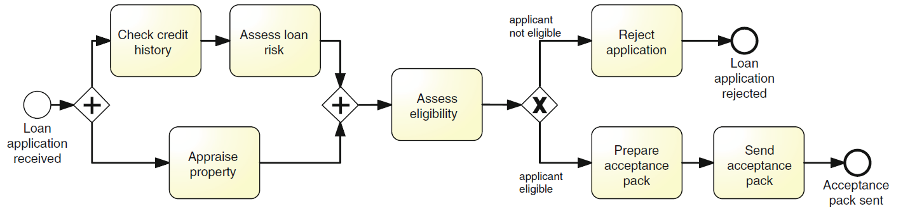
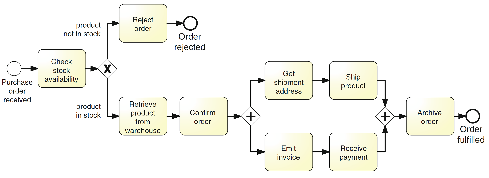
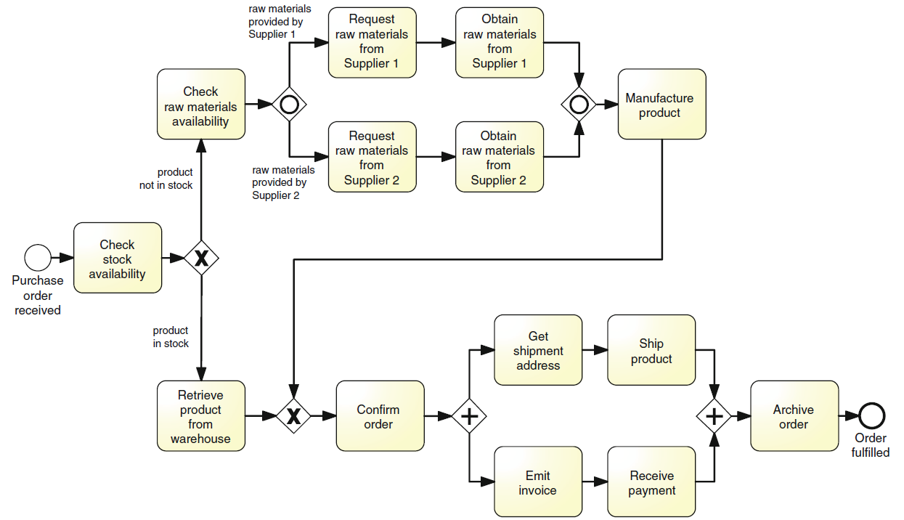
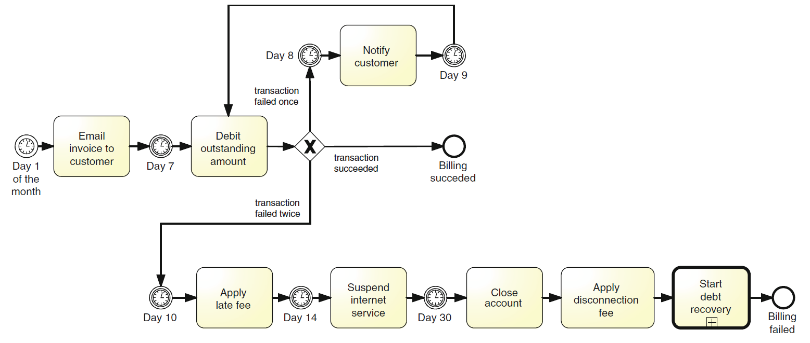

# *A training framework for BPM Modeling interviews based on LLM assistants* - Supplementary material

This repository contains the supplementary material of the paper entitled "A training framework for BPM Modeling interviews based on LLM assistants", submitted to BPM 2025. 

## 🤖  **BPM-LEIA** 
**BPM-LEIA** (BPM Learning-Enabling Intelligent Assistant) is an AI-powered tool designed to simulate realistic process domain expert interviews for training students to gather the information needed to build an accurate process model.

## 🎥 Video
🔗 Link to the [video](https://jedai.short.gy/bpm25-video) that screencasts and demonstrates the tool. 

## 📝 List of available exercises
In order to try the BPM-LEIA, we have develop the following examples that correspond with exercises present in the book **Fundamentals of Business Process Management** [[1]]([README.md#-references).

### Assessing loan application process (*Exercise 3.2, page 84. Process model solution, page 109.*)
* **<a href="https://leia-workbench-front-v3-a393ff9e36a2.herokuapp.com/?email=_test_b25&code=RMCFIG25GZ3NKRNUH" target="_blank">Demo Link</a>** to the interview exercise on the _loan application process_. 
* **Exercise Code**: RMCFIG25GZ3NKRNUH
* **Process**: Assessing loan application process

    

    A loan application is approved if it passes two checks: (i) the applicant’s loan risk assessment, done automatically by a system, and (ii) the appraisal of the property for which the loan has been asked, carried out by a property appraiser. The risk assessment requires a credit history check on the applicant, which is performed by a financial officer. Once both the loan risk assessment and the property appraisal have been performed, a loan officer can assess the applicant’s eligibility. If the applicant is not eligible, the application is rejected, otherwise the acceptance pack is prepared and sent to the applicant.

### Order fulfillment process (*Example 3.4, solution in Figure 3.6, page 83.*)

* **<a href="https://leia-workbench-front-v3-a393ff9e36a2.herokuapp.com/?email=_test_b25&code=RMCEHF59FZAUNSP5O" target="_blank">Demo Link</a>** to the interview exercise on the _order fulfillment process_. 
* **Exercise Code**: RMCEHF59FZAUNSP5O
* **Process**: Order fulfillment process

    

    The order fulfillment process starts whenever a purchase order has been received from a customer. The first activity that is carried out is checking if the product is in stock, otherwise the process completes by rejecting the order. Further, if the product is in stock, the product is requested from the warehouse and the order is  confirmed. Afterwards, the requested product is shipped (after the shipment address is received so that the product can be shipped to the customer) while the invoice is emitted and the payment is received. Afterwards, only when the shipment is completed and the payment has been received, the order is archived and the process completes.

### Order-to-cash process (*Example 3.6, solution in Figure 3.12, page 90.*)

* **<a href="https://leia-workbench-front-v3-a393ff9e36a2.herokuapp.com/?email=_test_b25&code=RMCFPP2K7QUKS58CC" target="_blank">Demo Link</a>** to the interview exercise on the _order-to-cash process_. 
* **Exercise Code**: RMCFPP2K7QUKS58CC
* **Process**: Order-to-cash process

    

    The order fulfillment process starts whenever a purchase order has been received from a customer. If the product requested is not in stock, it needs to be manufactured before the order handling can continue. To manufacture a product, the required raw materials have to be ordered. Two preferred suppliers provide different types of raw materials. Depending on the product to be manufactured, raw materials may be ordered from either Supplier 1 or Supplier 2, or from both. Once the raw materials are available, the product can be manufactured and the order can be confirmed. On the other hand, if the product is in stock, it is retrieved from the warehouse before confirming the order. In either case, the process continues normally and the order is  confirmed. Afterwards, the requested product is shipped (after the shipment address is received so that the product can be shipped to the customer) while the invoice is emitted and the payment is received. Afterwards, only when the shipment is completed and the payment has been received, the order is archived and the process completes.

### ISP billing process (*Exercise 4.5, page 125. Process model solution, page 143.*)

* **<a href="https://leia-workbench-front-v3-a393ff9e36a2.herokuapp.com/?email=_test_b25&code=RMCHR18X9DBGERCO5" target="_blank">Demo Link</a>** to the interview exercise on the _internet service provider billing process_. 
* **Exercise Code**: RMCHR18X9DBGERCO5
* **Process**: Internet service provider billing process

    

    An Internet Service Provider's (ISP) billing process begins when the ISP sends an invoice by email to the customer on the first working day of each month (Day 1). On Day 7, the customer has the full outstanding amount automatically debited from its bank account. If an automatic transaction fails for any reason, the customer is notified on Day 8. On Day 9, the transaction that failed on Day 7 is re-attempted. If it fails again, on Day 10 a late fee is charged to the customer’s bank account. At this stage, the automatic payment is no longer attempted. On Day 14, the Internet service is suspended until payment is received. If the payment is still outstanding on Day 30, the account is closed and a disconnection fee is applied. A debt-recovery procedure is then started.

## ✍️ Authors 
Bedilia Estrada Torres1
 José Antonio Parejo1
 Armando Fox 2
 Pablo Fernández1

_Affiliations:_
 1 SCORE Lab, Universidad of Sevilla, Sevilla, Spain
 2 University of California, Berkeley CA, USA

     

## 📖 References

\[1\] Dumas, M., La Rosa, M., Mendling, J., & Reijers, H. A. (2018). Fundamentals of Business Process Management (2nd ed.). Springer

